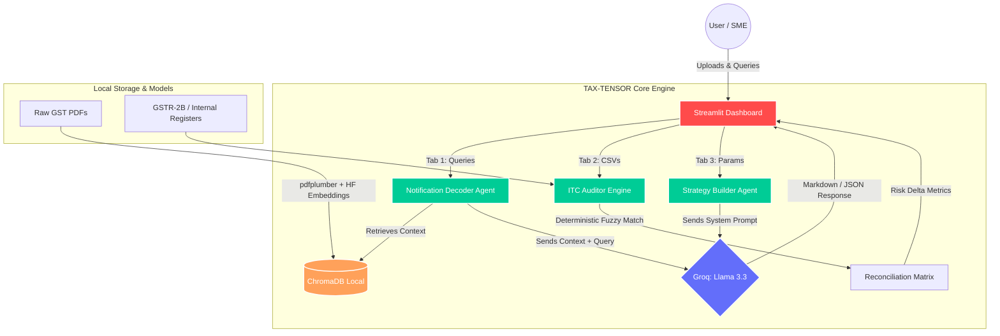

# ⚖️ TAX-TENSOR 
### AI Corporate Tax Restructuring & GST Auditor

TAX-TENSOR is a multi-agent AI system built to help Indian enterprises understand, interpret, and comply with rapidly changing GST regulations and corporate tax codes—without the exorbitant cost of external tax consultants.

## 🚀 The Problem
* The Indian GST code is updated via CBIC notifications almost weekly.
* SMEs lose millions of rupees annually in unclaimed Input Tax Credit (ITC) due to vendor mismatch errors.
* Accessing elite corporate structuring advice (e.g., Section 80-IA, 80JJAA) is cost-prohibitive for startups.

## 🧠 The Solution (Features)
TAX-TENSOR operates as a localized, enterprise-grade AI financial suite across three core modules:

1. **📜 Notification Decoder (RAG):** Upload any dense CBIC/GST PDF. Our local ChromaDB vector store and Llama 3.3 agent decodes the legal jargon into plain-English business impact reports with exact clause-level citations. 
2. **🔍 ITC Gap Detector (Pandas Engine):** Upload your internal purchase register and the government's GSTR-2B. TAX-TENSOR uses deterministic fuzzy-matching to detect unrecorded invoices, calculating exact ITC financial risk in seconds.
3. **🏗️ Tax Strategy Builder:** Input your sector and turnover. The AI acts as a Chartered Accountant, generating compliant corporate structuring advice to optimize tax liability, visualized dynamically via Plotly.

## 🛠️ Tech Stack
* **Frontend:** Streamlit, Plotly
* **LLM Engine:** Groq (Llama-3.3-70b-versatile)
* **Vector Database:** ChromaDB (Local, Zero-cost)
* **Embeddings:** HuggingFace (`all-MiniLM-L6-v2`)
* **Data Processing:** Pandas, Regex, pdfplumber

## ⚙️ Local Setup & Installation

**Prerequisites:** Python 3.10 or higher.

**1. Clone the repository**
```bash
git clone https://github.com/Kavya-Jain/tax_tensor.git
cd tax_tensor
```

**2. Install dependencies**
```bash
pip install -r requirements.txt
```
*(Note: The first run will automatically download the 80MB HuggingFace embedding model to your local machine.)*

**3. Set up environment variables**
Create a `.env` file in the root directory and add your free Groq API Key:
```text
GROQ_API_KEY=gsk_your_groq_key_here
```

**4. Run the Application**
```bash
streamlit run app.py
```

## 📂 Project Architecture



```text
tax_tensor/
│
├── app.py                     # Main Streamlit dashboard UI
├── requirements.txt           # Python dependencies
├── .env                       # API configurations
│
├── agents/                    # LLM & Logic Orchestration
│   ├── decoder_agent.py       # RAG pipeline for tax circulars
│   ├── itc_auditor.py         # Pandas fuzzy-matching reconciliation
│   └── strategy_builder.py    # Generative structuring advice
│
├── core/
│   └── vectorstore.py         # ChromaDB + HuggingFace integration
│
└── data/                      # Local persistent storage
    ├── circulars/             # Uploaded PDF notifications
    ├── ledgers/               # CSV transaction data
    └── chroma_db/             # Local vector database
```

## 📝 License
MIT License.